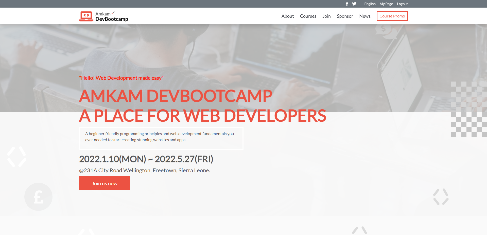
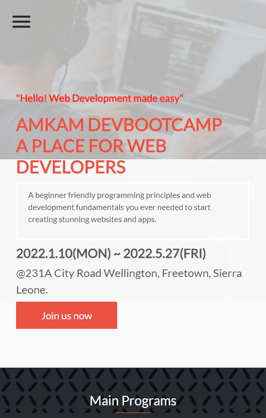

# Amkam DevBootcamp Capstone Project

Thi Capstone project is a project required students to build a project from scratch to finish. It's a solo project for all students as it marks the end of a module.

#### Desktop Screenshot

#### Mobile Screenshot

## Built With

- HTML and CSS

- ESLint

- JavaScript

## Live Demo

<a href="#">Amkam DevBootcamp</a>

## Getting Started

This is an exercise requiring a student to develop a website as a capstone project individually.

## Author:

- Github: @<https://github.com/AmaduKamara>

- LinkedIn: @<https://www.linkedin.com/in/amadu-kamara-3b60a25b/>

- Twitter: @<https://twitter.com/DevAmkam/>

- Facebook: @<https://www.facebook.com/amadus.kamara.7/>

## 🤝 Contributing

Contributions, issues, and feature requests are welcome!
Feel free to check the <a href="#">issues page</a>

## Show your support

Give a ⭐️ if you like this project!

## Acknowledgments

- Thanks to Microverse code reviewers for your reviews. Your reviews made my code better and enhanced the look of my capstone project.
- Thanks to my coding partners for collaborating with me on this project, giving suggestions and support.
- And most importantly, thanks, to Microverse for the opportunity given in making me a Professional remote Software developer. I am looking forward to becoming a great one.
